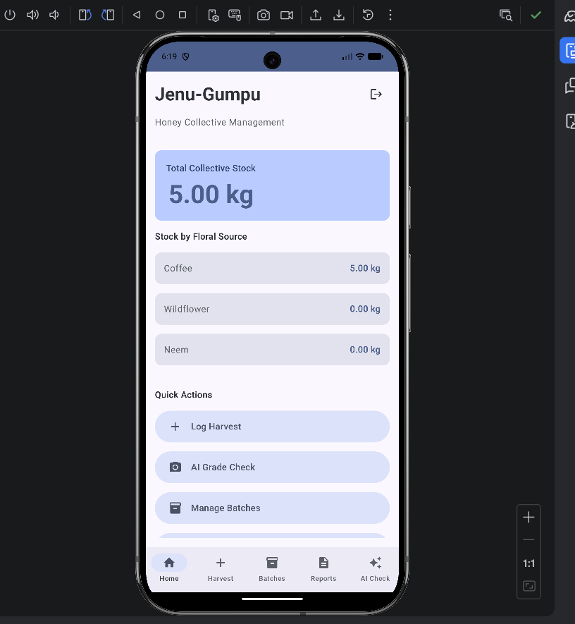
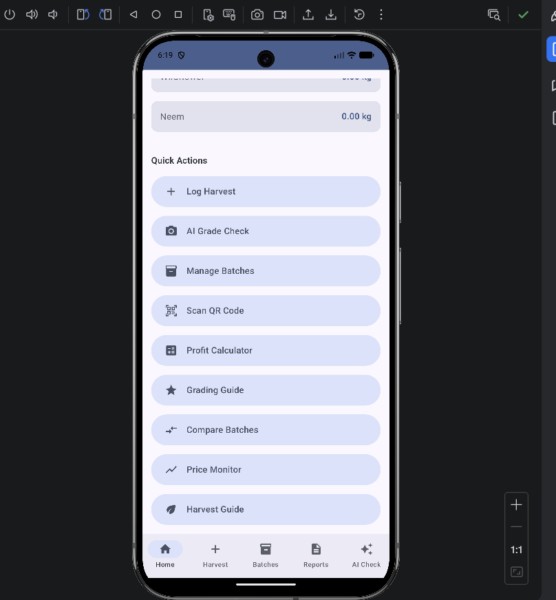
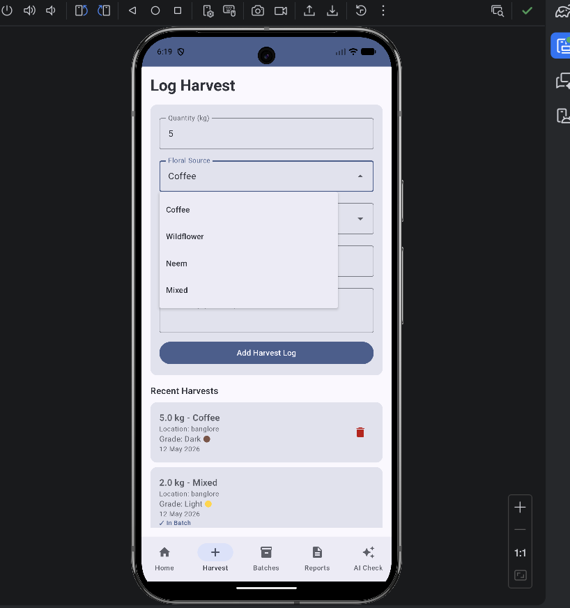
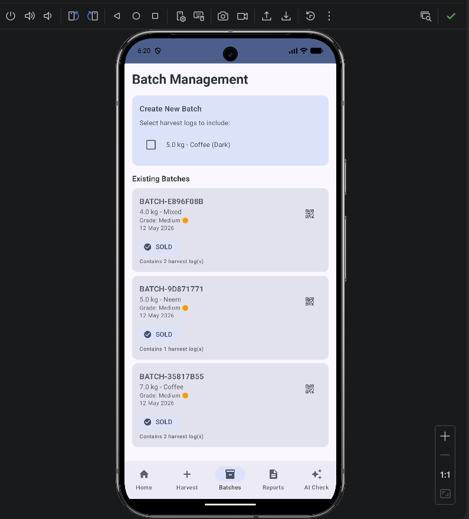
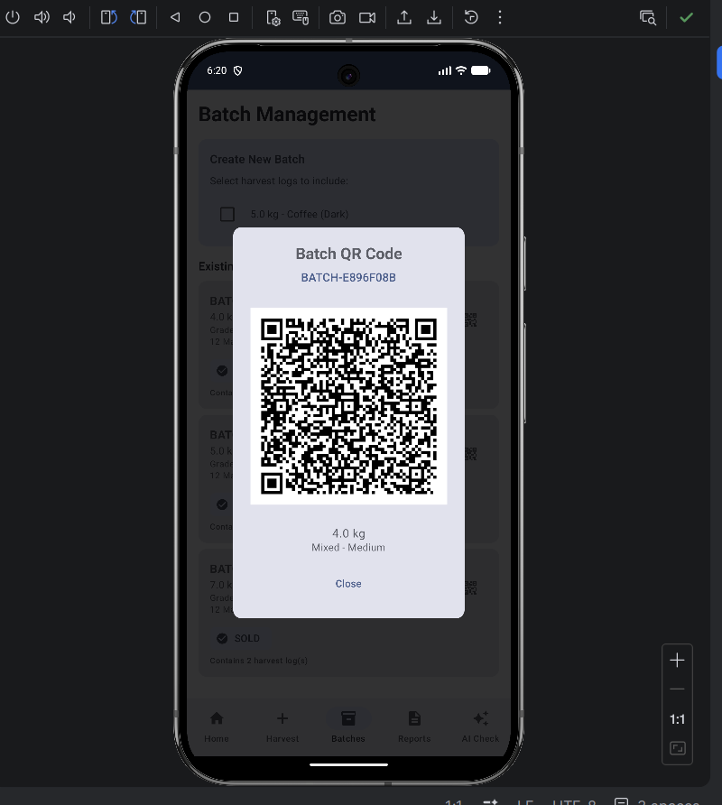

# Jenu-Gumpu 🍯
**Honey Collective Management System for Rural Beekeepers**

A complete, production-ready Android application built with Kotlin, Jetpack Compose, and modern Android architecture. Works 100% OFFLINE with local storage, AI-based honey grading, and QR code batch management.

---

## 📸 Screenshots

<table>
  <tr>
    <td align="center"><b>🏠 Home Dashboard</b></td>
    <td align="center"><b>⚡ Quick Actions</b></td>
    <td align="center"><b>🌾 Log Harvest</b></td>
  </tr>
  <tr>
    <td></td>
    <td></td>
    <td></td>
  </tr>
  <tr>
    <td align="center"><b>📦 Batch Management</b></td>
    <td align="center"><b>🔳 QR Code</b></td>
    <td></td>
  </tr>
  <tr>
    <td></td>
    <td></td>
    <td></td>
  </tr>
</table>

---

## 🎯 Features

### Core Features
1. **Harvest Log System**
   - Add harvest entries with quantity, floral source, grade, and date
   - View all harvest logs in a chronological list
   - Persistent local storage using Room Database

2. **Collective Stock Management**
   - Real-time total stock calculation
   - Stock breakdown by floral source (Coffee, Wildflower, Neem)
   - Automatic updates via Flow

3. **Batch Management**
   - Create batches from multiple harvest logs
   - Track batch status: COLLECTED → PACKED → READY → SOLD
   - Automatic QR code generation for each batch
   - View batch details with associated harvest logs

### Advanced Features
4. **📸 AI-Based Honey Grading (Offline)**
   - Camera preview using CameraX
   - Real-time image capture
   - TensorFlow Lite inference for grade classification
   - Output: Grade (Light/Medium/Dark) with confidence percentage
   - Fallback color analysis when model is unavailable

5. **🔳 QR Code Generation**
   - Automatic QR generation for each batch
   - Contains: batch ID, floral source, grade, quantity, date
   - Offline generation using ZXing library
   - High-resolution QR codes ready for printing

6. **🔍 QR Code Scanner (Offline Verification)**
   - ML Kit Barcode Scanning (works offline)
   - Scan batch QR codes
   - Instant batch verification from local database
   - Display complete batch information and history

7. **💰 Profit Calculator**
   - Calculate profit based on cost and selling price
   - Real-time calculations
   - Profit margin percentage
   - Profit per kg breakdown

---

## 🏗️ Architecture

### MVVM (Model-View-ViewModel)
```
UI Layer (Compose Screens)
    ↓
ViewModel Layer (Business Logic + State)
    ↓
Repository Layer (Single Source of Truth)
    ↓
Data Layer (Room Database + DAOs)
```

### Technology Stack
- **Language**: Kotlin 2.0+
- **UI**: Jetpack Compose with Material3
- **Architecture**: MVVM + Repository Pattern
- **Database**: Room (SQLite)
- **Async**: Kotlin Coroutines + Flow + StateFlow
- **Camera**: CameraX
- **AI**: TensorFlow Lite (offline inference)
- **QR**: ZXing (generation) + ML Kit (scanning)
- **Navigation**: Jetpack Navigation Compose
- **Dependency Injection**: Manual (ViewModelFactory)

---

## 📦 Project Structure

```
app/src/main/java/com/jenugumpu/app/
├── data/
│   ├── entity/          # Database entities
│   │   ├── HarvestLog.kt
│   │   ├── Batch.kt
│   │   ├── BatchLogCrossRef.kt
│   │   └── BatchWithLogs.kt
│   ├── dao/             # Data Access Objects
│   │   ├── HarvestLogDao.kt
│   │   └── BatchDao.kt
│   ├── database/        # Database setup
│   │   ├── JenuGumpuDatabase.kt
│   │   └── Converters.kt
│   └── repository/      # Repository layer
│       └── HoneyRepository.kt
├── ml/                  # Machine Learning
│   └── HoneyGradeClassifier.kt
├── navigation/          # Navigation routes
│   └── Screen.kt
├── ui/
│   ├── screen/          # Compose screens
│   │   ├── HomeScreen.kt
│   │   ├── HarvestScreen.kt
│   │   ├── StockScreen.kt
│   │   ├── CameraScreen.kt
│   │   ├── QRScannerScreen.kt
│   │   └── ProfitScreen.kt
│   ├── theme/           # Material3 theme
│   │   ├── Theme.kt
│   │   └── Type.kt
│   └── viewmodel/       # ViewModels
│       ├── HarvestViewModel.kt
│       ├── StockViewModel.kt
│       ├── CameraViewModel.kt
│       ├── QRScannerViewModel.kt
│       ├── ProfitViewModel.kt
│       └── ViewModelFactory.kt
├── utils/               # Utilities
│   ├── QRCodeGenerator.kt
│   └── DateFormatter.kt
└── MainActivity.kt      # App entry point
```

---

## 🚀 Getting Started

### Prerequisites
- Android Studio Hedgehog (2023.1.1) or later
- JDK 17
- Android SDK 34
- Physical device or emulator with API 26+

### Installation

1. **Clone or copy the project** into Android Studio

2. **Sync Gradle dependencies**
   - Android Studio will automatically download all dependencies
   - Wait for Gradle sync to complete

3. **Add TensorFlow Lite Model (Optional)**
   - The app works WITHOUT a model (uses color analysis fallback)
   - To add a real model:
     - Create folder: `app/src/main/assets/`
     - Add your `.tflite` model file named: `honey_grade_model.tflite`
     - Model requirements:
       - Input: 224x224 RGB image
       - Output: 3 classes (Light, Medium, Dark)

4. **Run the app**
   - Connect Android device or start emulator
   - Click "Run" in Android Studio
   - Grant camera permission when prompted

---

## 📱 Usage Guide

### 1. Logging Harvest
- Navigate to "Harvest" tab
- Enter quantity in kg
- Select floral source (Coffee, Wildflower, Neem, Mixed)
- Choose grade (Light, Medium, Dark)
- Optional: Add notes
- Tap "Add Harvest Log"

### 2. AI Grading
- Home → "AI Grade Check" OR Camera tab
- Grant camera permission
- Point camera at honey sample
- Tap capture button
- View classification result with confidence
- Use grade when logging harvest

### 3. Creating Batches
- Navigate to "Batches" tab
- Select harvest logs to include
- Choose batch grade
- Tap "Create Batch"
- Batch ID is auto-generated
- QR code is automatically created

### 4. QR Code Verification
- Home → "Scan QR Code" OR More tab
- Point camera at batch QR code
- View batch details instantly
- See all harvest logs in the batch

### 5. Profit Calculation
- Home → "Profit Calculator"
- Enter quantity, cost per kg, selling price
- Tap "Calculate"
- View total profit, profit per kg, and margin

---

## 🗄️ Database Schema

### HarvestLog
| Field | Type | Description |
|-------|------|-------------|
| id | Long | Primary key |
| quantity | Double | Quantity in kg |
| floralSource | Enum | Coffee, Wildflower, Neem, Mixed |
| grade | String | Light, Medium, Dark |
| date | Long | Timestamp |
| notes | String | Optional notes |
| isUsedInBatch | Boolean | Tracking flag |

### Batch
| Field | Type | Description |
|-------|------|-------------|
| batchId | String | Primary key (auto-generated) |
| totalQuantity | Double | Sum of all logs |
| grade | String | Batch grade |
| floralSource | Enum | Dominant source |
| createdDate | Long | Timestamp |
| status | Enum | COLLECTED, PACKED, READY, SOLD |

### BatchLogCrossRef
Many-to-many relationship between Batch and HarvestLog

---

## 🧠 How AI Grading Works

### With TensorFlow Lite Model:
1. **Capture**: CameraX captures image from camera
2. **Preprocessing**: Image resized to 224x224, normalized
3. **Inference**: TFLite model runs locally (offline)
4. **Output**: Probabilities for each class
5. **Display**: Highest confidence class shown

### Without Model (Fallback):
1. **Color Analysis**: Analyzes average RGB values
2. **Brightness Calculation**: Determines honey lightness
3. **Classification**: Rules-based grade assignment
4. **Confidence**: Estimated based on color metrics

---

## 🔐 Permissions

### Required:
- **CAMERA**: For AI grading and QR scanning

### Handling:
- Runtime permission requests using Accompanist library
- Graceful fallbacks when permission denied
- Clear permission rationale to user

---

## 🧪 Testing

### Manual Testing Checklist:
- [ ] Add harvest log → verify in list
- [ ] Create batch → verify QR generation
- [ ] Scan QR code → verify batch retrieval
- [ ] Capture photo → verify grade classification
- [ ] Calculate profit → verify calculations
- [ ] Check stock breakdown → verify accuracy
- [ ] Update batch status → verify persistence
- [ ] Test offline → verify all features work

---

## 📚 Key Concepts Explained

### 1. **Compose Recomposition**
- UI automatically updates when StateFlow emits new data
- No manual view updates needed
- Efficient: only changed parts re-render

### 2. **Flow vs StateFlow**
- Flow: Cold stream, starts on collection
- StateFlow: Hot stream, always has current value
- Used for reactive database queries

### 3. **Room Database**
- Type-safe SQL queries
- Observable queries via Flow
- Automatic background threading

### 4. **CameraX**
- Simplified camera API
- Lifecycle-aware
- Consistent behavior across devices

### 5. **TensorFlow Lite**
- Optimized for mobile
- Runs on-device (offline)
- Small model size
- Fast inference

---

## 🛠️ Customization

### Add New Floral Source:
1. Edit `FloralSource` enum in `HarvestLog.kt`
2. Rebuild - that's it! Enum automatically populates UI

### Change Color Theme:
1. Edit `Theme.kt`
2. Modify `HoneyYellow`, `HoneyAmber`, `HoneyDark` colors

### Add New Field to Harvest:
1. Add field to `HarvestLog` entity
2. Update database version
3. Add UI input in `HarvestScreen.kt`
4. Update ViewModel

---

## ⚠️ Troubleshooting

### App crashes on camera:
- Grant camera permission
- Test on physical device (emulator cameras are limited)

### TFLite model not loading:
- Check file name: `honey_grade_model.tflite`
- Check location: `app/src/main/assets/`
- App will use fallback if model missing

### Database migration error:
- Uninstall and reinstall app
- Or increment database version in `JenuGumpuDatabase.kt`

### Gradle sync issues:
- File → Invalidate Caches → Invalidate and Restart
- Check internet connection
- Update Android Studio

---

## 🎓 Learning Resources

This project demonstrates:
- ✅ Clean Architecture
- ✅ MVVM pattern
- ✅ Jetpack Compose
- ✅ Room Database
- ✅ Kotlin Coroutines & Flow
- ✅ Camera integration
- ✅ ML on Android
- ✅ QR code handling
- ✅ Material3 Design
- ✅ Navigation Compose

Perfect for learning modern Android development!

---

## 📄 License

This is a demonstration project created for educational purposes.

---

## 👨‍💻 Author

Built as a complete Android reference application showcasing:
- Production-ready code structure
- Best practices
- Offline-first architecture
- Modern Android development

**For rural beekeepers, by technology** 🐝✨

---

## 🔮 Future Enhancements

- Export batch data as PDF
- Backup/restore to external storage
- Multi-user support
- Cloud sync (optional)
- Price trends and analytics
- Weather integration
- Batch history timeline

---

**Ready to compile and run!** 🚀
